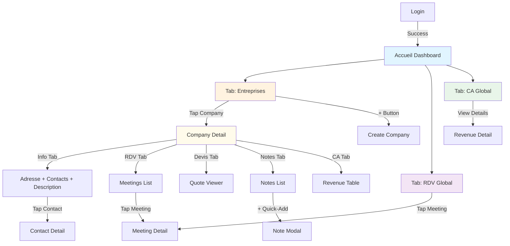
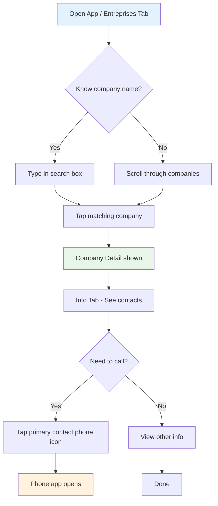
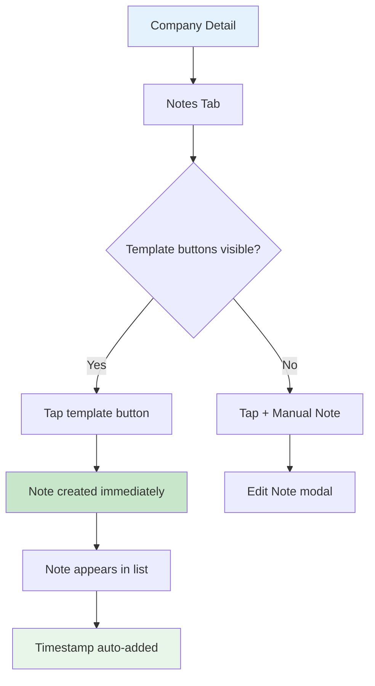
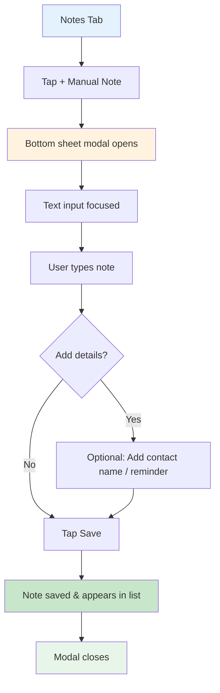
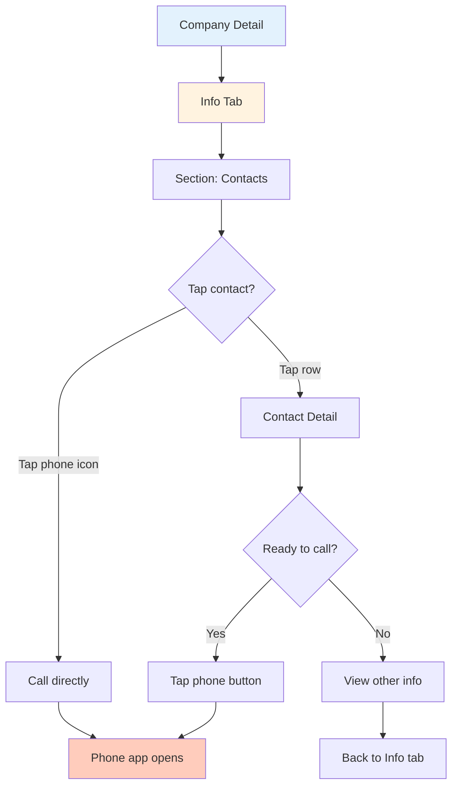
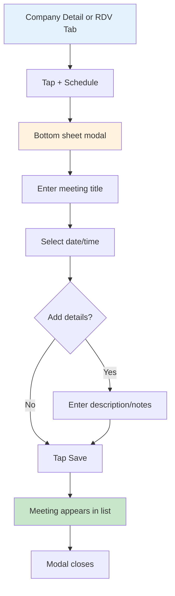

# Arius — UI/UX Specification

**Project**: Arius — Mobile-First CRM for Field Sales Representatives  
**Version**: 1.0  
**Date**: 15 janvier 2026  
**Author**: UX Expert (BMad Orchestrator)  
**Status**: Ready for Architecture & Development

---

## 1. Introduction

This document defines the user experience goals, information architecture, user flows, and visual design specifications for Arius's user interface. It serves as the foundation for visual design and frontend development, ensuring a cohesive and user-centered experience.

**Source Documents**:

- [PRD (Product Requirements Document)](./prd.md)
- Cahier des charges officiel Arius

---

## 2. Overall UX Goals & Principles

### Target User Personas

**Primary: Commercial Terrain (Field Sales Rep)**

- Works exclusively on mobile in the field
- Solo user or small team (1–10 users, each with isolated account)
- Single-hand operation (holding client folder, driving, etc.)
- Often on weak network (4G, rural areas)
- **Primary tasks**:
  - Find company details before meeting (location, contact info, past interactions)
  - Add meeting notes immediately after call/visit (<30 seconds total)
  - Quick call to contact (1–2 taps)
- **Pain point**: Despises switching apps or complex navigation; needs instant info access

**Secondary (Future – Not MVP):**

- Commercial sédentaire (desk-based user) — Same account, same data, accessed via React Native Web. **Not a separate persona for MVP.**

**Note on Multi-Account:** Multiple users possible (different sales reps), but each account is completely isolated. No team management, no shared data, no manager overview in MVP.

---

### Usability Goals

1. **Speed of Critical Actions**:

   - Add note via template: **1 tap** (instant)
   - Add manual note: **< 10 seconds** (tap, type, save)
   - Find company before meeting: **< 5 seconds** (search or scroll)
   - Call contact: **< 2 taps**

2. **Offline Resilience**:

   - Read all company/contact/meeting data offline
   - Add notes offline; sync when connected
   - No data loss on connection interruption

3. **One-Hand Usability**:

   - All interactive elements within thumb reach (48px+ at bottom half of screen)
   - No requiring two-hand operations or landscape mode
   - Minimal horizontal scrolling

4. **Error Recovery**:

   - Clear confirmation for destructive actions (delete company/contact)
   - Ability to undo recent note additions (if feasible)

5. **Reliability on Weak Network**:
   - App loads and displays cached data quickly
   - API requests timeout gracefully; user can retry manually

---

### Design Principles

1. **Speed > Beauty** — Fast interaction beats polished animations. Instant feedback over smoothness.

2. **Mobile Touch-First** — Every control optimized for thumb reach; 48px+ tap targets at bottom-half of screen.

3. **Context Preservation** — Always show: "I'm viewing Company X" → Related entities (Info, RDV, Devis, Notes, CA). No deep nesting.

4. **One Primary Action Per Screen** — Each screen has ONE clear call-to-action (add contact, add note, schedule meeting, etc.). Secondary actions are de-emphasized.

5. **Minimal Cognitive Load** — Flat navigation, icon + label, no modals unless necessary. Users in the field don't have mental bandwidth for complexity.

6. **Offline-First Data Display** — Downloaded data is immediately readable; sync happens silently in background.

7. **Clear Visual Hierarchy** — Company name (large), status (color badge), most recent activity (timestamp). Metadata secondary.

---

### Change Log

| Date       | Version | Description                     | Author    |
| ---------- | ------- | ------------------------------- | --------- |
| 2026-01-15 | 1.0     | Initial front-end spec from PRD | UX Expert |

---

## 3. Information Architecture (IA)

### Site Map / Screen Inventory

```
Arius App
│
├── Authentication Flow (Non-Authenticated)
│   ├── Login Screen
│   └── Registration Screen
│
└── Main App (Authenticated)
    ├── Tab 1: Accueil (Dashboard)
    │   ├── Métriques clés
    │   ├── CA mensuel / annuel
    │   ├── Prochains RDV (3)
    │   └── Activité récente
    │
    ├── Tab 2: Entreprises (Company List)
    │   ├── Liste des entreprises
    │   ├── Company Detail
    │   │   ├── Info Tab (adresse, contacts, description)
    │   │   ├── RDV Tab (meetings for this company)
    │   │   ├── Devis Tab (quotes)
    │   │   ├── Notes Tab (notes)
    │   │   └── Chiffre d'affaires Tab (revenue for this company)
    │   └── Create Company
    │
    ├── Tab 3: RDV (Meetings Global)
    │   ├── Tous les RDV (toutes entreprises)
    │   ├── À venir / Passés
    │   └── Meeting Detail/Edit
    │
    └── Tab 4: CA (Revenue Global)
        ├── Vue globale CA annuel
        ├── Tableau récapitulatif
        └── Objectif CA
```

**Mermaid Diagram:**



---

### Navigation Structure

#### Primary Navigation: Bottom Tab Bar (4 Tabs)

| Tab | Icon        | Label           | Screen           | Description                               |
| --- | ----------- | --------------- | ---------------- | ----------------------------------------- |
| 1   | 🏠 Home     | **Accueil**     | Dashboard        | Métriques clés, activité récente          |
| 2   | 🏢 Building | **Entreprises** | Company List     | Toutes les entreprises (liste principale) |
| 3   | 📅 Calendar | **RDV**         | Meetings List    | Tous les RDV (à venir + passés)           |
| 4   | 💰 Chart    | **CA**          | Revenue Overview | Chiffre d'affaires global                 |

**Rationale**: Bottom tab bar is thumb-reachable on mobile; 4 tabs is manageable without overflow. All major sections accessible from anywhere.

**Implementation Notes:**

- Tab bar always visible (sticky at bottom)
- Active tab: Blue icon + text (#2563eb)
- Inactive tabs: Gray icon + text (#6b7280)
- Minimum touch target: 56px height

---

#### Secondary Navigation: Company Detail Tabs (5 Tabs)

When user opens a company from Entreprises tab, show **5 horizontal tabs** (swipeable or tappable):

| #   | Tab Label              | Content                                                     |
| --- | ---------------------- | ----------------------------------------------------------- |
| 1   | **Info**               | Adresse complète, contacts associés, description entreprise |
| 2   | **RDV**                | Meetings (à venir + passés) pour cette entreprise           |
| 3   | **Devis**              | Documents devis uploadés (PDF, etc.)                        |
| 4   | **Notes**              | Chronologie notes + quick-add templates                     |
| 5   | **Chiffre d'affaires** | CA mensuel pour cette entreprise (tableau annuel)           |

**Info Tab Structure:**

```
Info Tab
├── Section: Adresse
│   ├── Rue
│   ├── Code postal
│   ├── Ville
│   └── Pays
├── Section: Contacts (liste)
│   ├── Contact principal (highlighted)
│   └── Autres contacts
└── Section: Description
    └── Texte libre (description entreprise)
```

**Rationale**: Each tab is a "vertical slice" of that entity type. User stays in company context; no deep nesting. Swipeable tabs allow natural horizontal gesture.

---

#### Breadcrumb Strategy

**Path Display:**

- Login/Register: None
- Accueil: None (is root)
- Entreprises: None (is root)
- Company Detail: `← Entreprises | Company Name`
- Contact Detail: `← Entreprises | Company Name | Info`
- Meeting Detail: `← RDV | Meeting Title` (or `← Entreprises | Company Name | RDV`)
- RDV Tab: None (is independent tab)
- CA Tab: None (is independent tab)

**Rationale**: Simple left arrow + current screen title. Breadcrumb helps orient users, especially after tapping multiple times. Mobile users rarely use breadcrumbs; back arrow is primary.

---

#### Modals & Overlays (Minimal)

- **Create/Edit Contact**: Bottom sheet or modal overlay (doesn't navigate away)
- **Create/Edit Meeting**: Bottom sheet or modal overlay
- **Add Note (Manual)**: Bottom sheet with text input
- **Confirm Delete**: Centered alert dialog
- **Export Data**: Full-screen modal or confirmation dialog

**Rationale**: Overlays preserve context (user sees company details underneath). Back button or X closes without losing state.

---

## 4. User Flows

### Flow 1: Find Company Before Meeting

**User Goal:** Retrouver une fiche entreprise + contact principal avant un RDV (30 secondes ou moins)

**Entry Points:**

- App opens → Tab: Entreprises → Company List screen
- Bottom tab: Entreprises

**Success Criteria:**

- Company found in < 5 seconds
- Company detail displayed with contact info visible (Info tab)
- Contact phone number accessible with 1 tap

**Flow Diagram:**



**Edge Cases & Error Handling:**

- **No search results**: Show "No companies match". Suggestion: Create new company?
- **Slow network**: Show cached company list immediately; search filters local first
- **Company not found**: Add quick "+" button to create new company from search screen
- **Contact has no phone**: Show email, other contact info; disable call button

**Notes:**

- Search is **real-time, as-you-type** (no submit button) for speed
- Company status badge visible (Client/Prospect/À réactiver/Fournisseur) for context
- Primary contact highlighted/pinned at top of Contacts section in Info tab

---

### Flow 2: Add Note via Template (1 Tap)

**User Goal:** Add a quick note immediately after call/visit using preset template (< 2 seconds)

**Entry Points:**

- From Company Detail → Notes tab
- Quick-add template button (visible on main Notes view)

**Success Criteria:**

- Note created with 1 tap on template button
- Note appears immediately in notes list with timestamp
- No modal, no confirmation required for templates

**Flow Diagram:**



**Preset Templates (suggested):**

- 📞 "Pas de réponse" (No answer)
- 💬 "Message laissé" (Message left)
- ✅ "Accepté RDV" (Agreed to meeting)
- 🔄 "Relance nécessaire" (Follow-up needed)
- 📧 "Email envoyé" (Email sent)
- ⏰ "Rappel dans X jours" (Remind in X days)

**Edge Cases & Error Handling:**

- **Offline**: Note saved locally; synced when connection restored
- **Network fails during sync**: Show "pending sync" badge; retry button available
- **Accidentally added wrong template**: Undo button visible for 30 seconds

**Notes:**

- **Zero friction design**: Tap template = done. No modals, no confirmations for templates.
- Templates appear as **large pill buttons** at top of Notes tab (thumb-reachable)

---

### Flow 3: Add Manual Note (< 10 Seconds)

**User Goal:** Add a detailed note with custom text (name, details, next steps)

**Entry Points:**

- From Company Detail → Notes tab
- Tap "+ Manual Note" or pencil icon

**Success Criteria:**

- Modal opens immediately
- Text input focused (keyboard appears)
- Tap Save → note appears in list
- Total time: < 10 seconds (including typing)

**Flow Diagram:**



**Edge Cases & Error Handling:**

- **Empty text**: Show "Note cannot be empty" warning; don't save
- **Offline**: Note saved locally; show "syncing..." indicator when connection returns
- **Long text**: No character limit (but show character count optional)
- **Keyboard doesn't dismiss**: Provide manual close button

**Notes:**

- Modal is **bottom sheet** (non-disruptive, preserves context)
- **Auto-timestamp** server-side (not user input)
- Optional fields: Link to contact, add reminder date (future feature)

---

### Flow 4: Quick Call to Contact (< 2 Taps)

**User Goal:** Call a contact immediately from company detail

**Entry Points:**

- Company Detail → Info tab → Section: Contacts → Tap phone icon on contact row (direct call)
- Company Detail → Info tab → Tap contact row → Contact Detail → Tap phone button

**Success Criteria:**

- Contact phone app opens within 1–2 taps
- Primary contact easily identifiable
- Fallback if no phone number available

**Flow Diagram:**



**Edge Cases & Error Handling:**

- **No phone number**: Show email instead; disable call button; suggest "Add phone to contact"
- **Multiple phone numbers**: Show both (direct + mobile); user selects which to call
- **Phone app not installed**: Show error; copy phone number to clipboard instead

**Notes:**

- **Primary contact highlighted** at top of Contacts section (green badge, star icon)
- Phone icon directly on contact row (one tap to call)
- Contact Detail shows all phone numbers; user can choose which to dial

---

### Flow 5: Schedule Meeting (Quick Entry)

**User Goal:** Schedule a meeting quickly before or after an interaction

**Entry Points:**

- **Option A**: Company Detail → RDV tab → Tap "+ Schedule Meeting"
- **Option B**: Bottom Tab: RDV (global) → Tap "+ Schedule Meeting" → Select company from list

**Success Criteria:**

- Meeting created in < 30 seconds
- Date/time picker is fast (not a full calendar)
- Meeting appears in upcoming list

**Flow Diagram:**



**Edge Cases & Error Handling:**

- **No title entered**: Show "Meeting title required" warning
- **Past date selected**: Warn "Date is in the past"; confirm if intentional
- **Offline**: Meeting saved locally; synced when online
- **Time conflict**: Warn if overlapping with another meeting (future feature)

**Notes:**

- Modal is **bottom sheet** for speed
- Date picker uses **native device picker** (fast, familiar)
- Title is primary; description optional
- Duration optional (defaults to 30 min or empty)

---

## 5. Branding & Style Guide

### Visual Identity Overview

Arius is a **professional, sans-serif modern** application designed for field sales representatives. The design must be:

- **Clear and fast** — Instant readability, no embellishments
- **Professional** — Inspires trust; not colorful/playful
- **Accessible** — High contrast, icons + text, readable in direct sunlight
- **Mobile-optimized** — Generous spacing, 48px+ touch targets

**Brand Personality:** Reliable, direct, efficient. Commercial trusts their CRM.

---

### Color Palette

#### Primary Colors

| Element              | Hex Code  | RGB           | Usage                                        | Notes                         |
| -------------------- | --------- | ------------- | -------------------------------------------- | ----------------------------- |
| **Primary Blue**     | `#2563eb` | 37, 99, 235   | Call-to-action buttons, active states, links | Accessible, professional      |
| **Primary Neutral**  | `#1f2937` | 31, 41, 55    | Text (headings, body), dark backgrounds      | Near-black, high contrast     |
| **Background Light** | `#f9fafb` | 249, 250, 251 | App background, card backgrounds             | Off-white, reduces eye strain |

#### Semantic Colors (Status & Actions)

| Status                         | Hex Code  | RGB          | Usage                                     | Icon        |
| ------------------------------ | --------- | ------------ | ----------------------------------------- | ----------- |
| **Client (Active)**            | `#16a34a` | 22, 163, 74  | Company status badge, success states      | ✓ checkmark |
| **Prospect (Interested)**      | `#0ea5e9` | 14, 165, 233 | Company status badge, info states         | ◯ circle    |
| **À Réactiver (Inactive)**     | `#FF9502` | 255, 149, 2  | Company status badge, warning states      | ⚠ caution   |
| **Fournisseur (Supplier)**     | `#9333EA` | 147, 51, 234 | Company status badge, supplier type       | ◆ diamond   |
| **Success (Action Complete)**  | `#10b981` | 16, 185, 129 | Confirmations, saved states, checkmarks   | ✓ check     |
| **Warning (Attention Needed)** | `#f97316` | 249, 115, 22 | Cautions, pending actions, notifications  | ⚠ warning   |
| **Error (Destructive)**        | `#ef4444` | 239, 68, 68  | Errors, delete actions, connection issues | ✗ x mark    |
| **Info (Neutral)**             | `#06b6d4` | 6, 182, 212  | Information, neutral actions, help        | ℹ info      |

#### Neutral Colors (Backgrounds, Borders, Text)

| Element      | Hex Code  | RGB           | Usage                                  |
| ------------ | --------- | ------------- | -------------------------------------- |
| **Gray 100** | `#f3f4f6` | 243, 244, 246 | Disabled states, subtle backgrounds    |
| **Gray 300** | `#d1d5db` | 209, 213, 219 | Borders, dividers, secondary lines     |
| **Gray 500** | `#6b7280` | 107, 114, 128 | Secondary text, metadata, timestamps   |
| **Gray 700** | `#374151` | 55, 65, 81    | Body text (secondary)                  |
| **Gray 900** | `#111827` | 17, 24, 39    | Body text (primary), important content |

#### Accessibility Compliance

- ✅ All text (primary gray on white/light bg) meets **WCAG AAA** (contrast ≥7:1)
- ✅ Status colors supported by **icon + text label** (not color-only)
- ✅ Blue for links meets WCAG AA (4.5:1 contrast)
- ✅ Fournisseur (Violet #9333EA): 5.2:1 contrast on white (AA compliant)
- ✅ À Réactiver (Orange #FF9502): 3.8:1 contrast on white (AA large text, requires bold or 18px+)
- ✅ No red-green only distinctions (color-blind safe)

---

### Typography

#### Font Families

| Type              | Font Stack                                                                                | Rationale                                                                     |
| ----------------- | ----------------------------------------------------------------------------------------- | ----------------------------------------------------------------------------- |
| **Headings & UI** | `-apple-system, BlinkMacSystemFont, "Segoe UI", "Roboto", "Oxygen", "Ubuntu", sans-serif` | System fonts: Fast load, familiar, accessible. Fallback to Roboto on Android. |
| **Body Text**     | Same as above                                                                             | Consistency; no separate serif font needed                                    |
| **Monospace**     | `"SF Mono", "Monaco", "Fira Code", monospace`                                             | Code snippets, timestamps (optional)                                          |

**Rationale:** System fonts load instantly on mobile; no web font downloads = faster on weak networks.

---

#### Type Scale

| Element                 | Size | Weight         | Line Height | Use Case                                           |
| ----------------------- | ---- | -------------- | ----------- | -------------------------------------------------- |
| **H1 (Screen Title)**   | 28px | 700 (Bold)     | 1.2         | Page titles (Accueil, Entreprises, Company Detail) |
| **H2 (Section Header)** | 22px | 600 (Semibold) | 1.3         | Section headings (Contacts, RDV tabs)              |
| **H3 (Subsection)**     | 18px | 600 (Semibold) | 1.4         | Card titles, meeting titles                        |
| **Body (Primary)**      | 16px | 400 (Regular)  | 1.5         | Body text, list items, contact info                |
| **Body (Secondary)**    | 14px | 400 (Regular)  | 1.5         | Metadata, timestamps, helper text                  |
| **Small (Captions)**    | 12px | 400 (Regular)  | 1.4         | Labels, badges, small UI text                      |
| **Button Text**         | 16px | 600 (Semibold) | 1.2         | CTA buttons, action labels                         |

**Rationale:**

- **Minimal scale** (5 sizes vs. 10+) for consistency
- **Large baseline (16px)** for mobile readability at arm's length
- **Bold headings** (600+) for visual hierarchy in crowded field
- **1.5 line height** for comfort reading on mobile

---

### Spacing & Layout

#### Grid System & Spacing Scale

| Unit    | Value (px) | Common Uses                                     |
| ------- | ---------- | ----------------------------------------------- |
| **XS**  | 4px        | Micro-spacing (badge padding, small gaps)       |
| **S**   | 8px        | Small spacing (button padding, minor gaps)      |
| **M**   | 16px       | Standard spacing (card padding, list item gaps) |
| **L**   | 24px       | Large spacing (section dividers, major gaps)    |
| **XL**  | 32px       | Extra-large (page margins, major sections)      |
| **2XL** | 48px       | Max spacing (between major content blocks)      |

**Grid Base:** 8px (all values multiples of 8 for alignment)

#### Safe Areas & Margins

- **Top/Bottom Tab Bar**: 56px (material design standard)
- **Page Margins** (horizontal): 16px on left/right (M spacing)
- **Card Padding**: 16px (M spacing)
- **List Item Padding**: 12px vertical, 16px horizontal
- **Safe Area (notch phones)**: OS handles automatically via RN

#### Touch Target Size

- **Minimum touch target**: 44px × 44px (WCAG AAA)
- **Recommended**: 48px × 48px (easier for field usage, one-hand)
- **Small UI elements** (close button, corner icon): 40px × 40px (acceptable)
- **Large interactive areas** (company row, contact row): Full width × 56px min

---

### Iconography

#### Icon Library

- **Primary**: Material Design Icons (Google) — 24px base size
  - Availability: Free, open-source, 4000+ icons
  - Consistency with Android Material Design
  - Support: Outlined (default), filled, rounded variants
- **Alternative**: Feather Icons (if preferring minimalist style)
  - Lightweight, 24px consistent
  - All icons same weight/stroke width

**Implementation**: Use icon font (e.g., `react-native-vector-icons`) for performance; no image loading.

#### Icon Usage Guidelines

| Icon Purpose                    | Size | Weight   | Color                            | Examples                        |
| ------------------------------- | ---- | -------- | -------------------------------- | ------------------------------- |
| **Tab Bar Icons**               | 24px | Outlined | Gray/Blue (active)               | Home, Building, Calendar, Chart |
| **Button Icons**                | 24px | Outlined | Gray (secondary), Blue (primary) | +, ×, ✓, ⚙                      |
| **Status Badges**               | 16px | Filled   | White (on colored bg)            | ✓, ◯, ⚠, ◆                      |
| **List Item Icons**             | 20px | Outlined | Gray 500                         | Phone, Email, Clock, MapPin     |
| **Action Icons (Phone, Email)** | 24px | Outlined | Blue (interactive)               | Phone dial, Envelope            |

**Spacing Rule:** Icon + text pair: 8px gap between icon and text

---

## 6. Component Library / Design System

### Core Components

Les 10 composants clés d'Arius :

**1. PRIMARY BUTTON** — CTA principal (Create, Save, Call). Blue (#2563eb), 48px height, full width par défaut, states: default/pressed/disabled/loading.

**2. SECONDARY BUTTON** — Actions secondaires (Cancel, Back). Transparent bg, blue border, 44px height.

**3. ERROR / DESTRUCTIVE BUTTON** — Supprimer, annuler. Red bg (#ef4444), same dimensions as primary.

**4. ICON BUTTON** — FAB (56px), inline (48px), small (40px). Blue bg, white icon.

**5. TEXT INPUT / FORM FIELD** — 48px height, 16px font (prevent iOS zoom), variants: single-line / multi-line / search / number. States: default / focused / filled / error / disabled.

**6. CARD / LIST ITEM** — Display companies, contacts, meetings, notes. Full width with 16px margins, min 56px height, tap anywhere → detail view. Status badges + color + icon.

**7. BOTTOM SHEET MODAL** — Non-disruptive overlays for create/edit. Variants: full height (80vh) / half height / full screen. Drag handle for dismiss, keyboard-aware.

**8. TABS (Horizontal)** — Navigate between sections. Active tab: blue text + 2px underline. 48px height, swipeable for 5+ tabs.

**9. STATUS BADGE** — Visual indicators with color + icon (never color-only). Client (green + ✓), Prospect (blue + ◯), À Réactiver (orange + ⚠), Fournisseur (violet + ◆).

**10. QUICK-ADD TEMPLATE BUTTONS (Pills)** — Single-tap note creation. 44px height, 20px border-radius, horizontal scroll view at top of Notes tab.

---

## 7. Accessibility Requirements

### Compliance Target: WCAG 2.1 Level AA

**Visual Accessibility:**

- Body text (16px): 7.8:1 (meets AAA)
- Large text (18px+): 7.8:1 (meets AAA)
- Touch targets: 44px × 44px minimum (48px recommended)
- Focus indicators: Blue (#2563eb) outline, 2px width

**Interaction:**

- Keyboard navigation: Tab/Shift+Tab, Enter/Space, Escape, Arrow keys
- Screen readers: VoiceOver (iOS), TalkBack (Android), NVDA/JAWS (Web)
- Semantic roles: All elements properly labeled

**Color-Blind Safe:**

- Client → Green + ✓ checkmark
- Prospect → Blue + ◯ circle
- À Réactiver → Orange + ⚠ caution
- Fournisseur → Violet + ◆ diamond

---

## 8. Responsive Design

### Breakpoints

- **Mobile** (320-767px): Primary target, bottom tab bar, single-column
- **Tablet** (768-1023px): Optional side nav, two-column possible
- **Desktop** (1024px+): Via React Native Web, side nav, multi-column

---

## 9. Animation & Micro-interactions

**Motion Principles:**

- Fast (< 300ms), purposeful, respect reduced motion
- 60fps minimum

**Key Animations:**

- Button press: Scale 0.98, 100ms
- Modal: Slide up 250ms, slide down 200ms
- Tab switch: Fade + slide 200ms
- Haptic feedback: Light (press), notification (success), heavy (error)

---

## 10. Next Steps

### Phase Complete: UX Specification ✅

**Deliverables:**

- ✅ User personas & usability goals
- ✅ Information architecture (4-tab navigation, 5-tab company detail)
- ✅ 5 critical user flows with Mermaid diagrams
- ✅ Complete design system (colors, typography, spacing, icons)
- ✅ 10 core components
- ✅ WCAG AA accessibility compliance
- ✅ Responsive design & animation guidelines

---

### Next Phase: Architect

**Task**: Create `docs/fullstack-architecture.md` with:

1. System Architecture (monorepo structure, deployment)
2. Backend Architecture (Express.js, middleware, error handling)
3. Database Schema (PostgreSQL, relationships, indexes)
4. Authentication Flow (JWT, Better Auth, user isolation)
5. Frontend Architecture (React Native, state management, routing)
6. API Specification (RESTful endpoints, schemas, error codes)
7. Deployment Guide (VPS, Coolify, CI/CD)
8. Technology Stack Decisions

**Input**: [PRD](./prd.md) + this front-end spec  
**Output**: `docs/fullstack-architecture.md`

**Recommended Command**: `*agent architect`

---

## Document Information

**Format**: Markdown  
**Generated**: 15 janvier 2026  
**Source**: PRD + UX Expert interactive sessions  
**Validation**: Ready for Architect review  
**Last Modified**: 15 janvier 2026

---

**END OF DOCUMENT**
